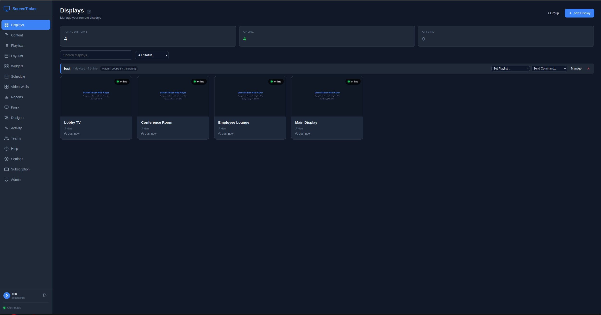

# ScreenTinker — Open-Source, Self-Hosted Digital Signage Software

<p align="center">
  
</p>

<p align="center">
  <a href="https://screentinker.com">Live demo</a> ·
  <a href="https://screentinker.com/docs">API reference</a> ·
  <a href="https://screentinker.com/guides/self-hosted-digital-signage.html">Self-hosting guide</a> ·
  <a href="https://discord.gg/utTdsrqq4Z">Discord</a>
</p>

ScreenTinker is a free, open-source **digital signage CMS** you can self-host on your own server — or run in our managed cloud. Manage TVs, video walls, and kiosks across multiple locations from one dashboard, with remote control, scheduling, playlists, and analytics. Built for retail, QSR menu boards, offices, lobbies, education, and any environment where you need centralized control over remote screens. Multi-tenant, MIT-licensed, single-developer maintained with direct contact access.

**Runs on any screen** — Android TV, Fire TV, Samsung Tizen, LG webOS, Amazon Vega OS, Raspberry Pi, Windows, ChromeOS, or any web browser. No per-device player licence, no hardware lock-in.

**Why self-host?** Keep your content and data on your own infrastructure, avoid per-screen SaaS fees, run air-gapped on a private LAN, and read or fork the source. Set `SELF_HOSTED=true` and a $5 VPS drives hundreds of screens.

**Hosted version:** [screentinker.com](https://screentinker.com) — free tier available, no credit card required.
**Guides:** [What is digital signage?](https://screentinker.com/guides/what-is-digital-signage.html) · [Open-source digital signage](https://screentinker.com/guides/open-source-digital-signage.html) · [Self-hosting guide](https://screentinker.com/guides/self-hosted-digital-signage.html)
**Community:** [Discord](https://discord.gg/utTdsrqq4Z)

## Features

- **Playlists** — first-class playlist objects: create, reorder, set per-item duration, share one playlist across multiple displays; draft/publish workflow with revert-to-published
- **Device groups** — organize displays into groups, assign a playlist to an entire group, send bulk commands (reboot, screen on/off, launch, update, shutdown), schedule content group-wide
- **Multi-zone layouts** — split screens into zones with drag-and-drop editor; 7 built-in templates (fullscreen, split, L-bar, PiP, grid)
- **Video walls** — combine multiple displays into one screen with bezel compensation, device rotation, and leader-based sync
- **Remote control** — live view, touch injection, key input, power on/off
- **Live video & Talk** — optional WebRTC path via a [go2rtc](https://github.com/AlexxIT/go2rtc) sidecar: sub-second live video of what a screen is actually playing (one screen watched by many dashboards without re-encoding), plus **Talk** — one-way announce or two-way intercom to a single screen, and one-way PA broadcast to a whole group or workspace, with an optional operator webcam shown fullscreen. Off by default and enabled per organization; an org can bring its own TURN/STUN. See [`docs/live-video.md`](docs/live-video.md)
- **Scheduling** — visual weekly calendar with recurrence rules (daily/weekly/monthly), priority-based conflict resolution, both device-level and group-level schedules (device-level overrides win over group-level), timezone support
- **Widgets** — clocks, weather, RSS tickers, text/HTML, webpages, social feeds, and Directory Board (scrolling lobby tenant/room/staff directories with dark/light themes, category management, and anti-burn-in motion)
- **Kiosk mode** — interactive touchscreen interfaces
- **Proof-of-play** — per-content and per-device analytics, hourly/daily breakdowns, CSV export for ad verification
- **Device telemetry** — battery, storage, RAM, CPU, Wi-Fi signal strength and uptime reported by the players, plus both of a display's addresses: its **local (LAN) IP** as the player sees itself, and the public/WAN address the server saw it connect from. Wi-Fi network name is included where the platform allows it (Android 10+ needs an opt-in location permission — see Device Setup)
- **Offline resilience** — both web and Android players keep displaying cached content during server or internet outages (Android ContentCache, web player Service Worker); state syncs when connectivity returns
- **Mobile-responsive** — full management dashboard and landing page work on phones and tablets
- **Workspaces** — multi-tenant data model: organizations contain workspaces, workspaces contain devices/content/playlists/schedules; users can be members of multiple workspaces and switch via a dropdown in the sidebar
- **Member roles** — six-level hierarchy (platform_admin / org_owner / org_admin / workspace_admin / workspace_editor / workspace_viewer) gated at every API route
- **Alerts** — email notifications via Microsoft Graph when devices go offline; built-in spam protection (2h dedup, 24h long-offline cutoff, sequential send pattern); per-user opt-out via Settings → Account
- **White-label** — custom branding, colors, logo, favicon, CSS, and domain
- **Content management** — folder organization, remote URL content (no upload needed), YouTube embeds, video duration detection via ffprobe, automatic thumbnail generation, Unicode-safe filenames (NFC normalization + UTF-8 multipart decoding)
- **Export/Import** — v2 format with playlists, device groups, schedules, and optional media bundling (ZIP); backward-compatible v1 import with automatic playlist migration
- **Device authentication** — per-device tokens for secure WebSocket connections; devices authenticate on every reconnect
- **Account management** — in-app password change, profile editing, email-based password reset
- **Security** — JWT auth, bcrypt hashing, parameterized SQL, rate-limited endpoints, per-user ownership checks on all resources, ongoing auth/IDOR/XSS audits
- **Built-in billing** — Stripe integration for SaaS subscriptions (optional)
- **Auto-update** — OTA updates pushed to devices automatically
- **Public REST API** — scoped personal access tokens (`read` / `write` / `full`) over the same resources the dashboard uses, workspace-confined by construction. Documented as an OpenAPI 3.1 contract ([`docs/openapi.yaml`](docs/openapi.yaml)) and browsable on any instance at `/docs` (served locally, no CDN, so it works air-gapped)
- **Node Mesh** — link ScreenTinker servers together so one dashboard can watch many. A site server reports upward to a hub over a consent-scoped link; a hub can relay content back down to a customer's server. Data flows up by default and nothing flows down uninvited: every write is a *request* the receiving server decides on against its own grant. See [Node Mesh](#node-mesh) below
- **Triggers** — let an external system interrupt a playlist with different content, fired over the LAN by HTTP POST or a UDP datagram (`ST1 <secret> <token>`). Resolved entirely on the device, so an evacuation message still appears with the WAN down. Targets a published playlist whose items are all cached locally, checked when you save rather than when it fires
- **Embedded & E-Paper Displays** — server-side renderer for low-power MCUs (ESP32-S3, Seeed Studio reTerminal Sticky, Waveshare e-paper, SPI TFTs). Delivers pre-dithered 1-bit bitstreams, RGB565, BMP, or PNG over HTTP with ETag/304 caching and deep sleep coordination. See [`docs/embedded-renderer.md`](docs/embedded-renderer.md)
- **Activity log** — full audit trail of user and system actions

## Architecture

### Multi-tenancy model

Three nested primitives:

```
organizations (billing + branding container)
   workspaces  (resource scope: devices, content, playlists, schedules, walls, layouts, widgets, groups)
      members (users with a role on that workspace)
```

Every resource (device, content row, playlist, schedule, etc.) carries a `workspace_id`. Every API route filters by it. Cross-workspace access requires switching workspaces via the sidebar dropdown — there are no magic role-based "see everything" bypasses on individual resource routes.

### Role hierarchy

Six roles, top wins:

| Role | Scope | Cap |
|---|---|---|
| `platform_admin` | every workspace in the system | full read/write (via acting-as on workspaces they're not a direct member of) |
| `org_owner` | one organization | billing + delete + admin within all workspaces in the org |
| `org_admin` | one organization | admin within all workspaces in the org (no billing) |
| `workspace_admin` | one workspace | manage members, rename, full read/write |
| `workspace_editor` | one workspace | create/edit content, devices, playlists, schedules; no member changes |
| `workspace_viewer` | one workspace | read-only |

### Workspace switcher

Users who are members of more than one workspace see a dropdown in the sidebar header. Switching mints a fresh JWT with the new `current_workspace_id` claim and reloads the page. Platform admins see every workspace in the system.

### Auto-migration on boot

Schema migrations run automatically the first time the server starts after a git pull. **Self-hosters never need to run a manual migration command.** On detecting a pre-multi-tenancy database, the server takes a timestamped snapshot (`server/db/remote_display.pre-migration-<timestamp>.db`), runs the Phase 1 migration (creates `organizations` / `workspaces` / `workspace_members` tables, backfills `workspace_id` on every resource, one auto-created Default workspace per existing user), then continues startup. If the migration fails the server prints the restore command and exits.

### Node Mesh

Two or more ScreenTinker servers can be linked, so an MSP, a franchise group or a multi-site estate
can see everything from one place without merging anybody's data into one tenant.

**It is off until you turn it on.** With `MESH_ACCEPT_ENROLLMENT` and `MESH_ALLOW_UPLINK` both unset
— the default — there are no mesh routes at all. Not routes that return empty: no routes. An
ordinary install cannot tell the feature exists.

| Variable | Meaning |
| --- | --- |
| `MESH_ACCEPT_ENROLLMENT` | This server may host others (it can hand out pairing codes) |
| `MESH_ALLOW_UPLINK` | This server may report to another one |
| `MESH_MAX_DEPTH` | How deep a chain may be (default `2`) |

**Pairing** is a one-time code, generated by the server that will *receive* the data, redeemed on
the one that will send it. The side handing over the code chooses what is shared — screen health,
identity, playback history, screenshots, diagnostics — because the grant belongs to whoever owns
the data, never to whoever asked for it.

**Data travels up. Nothing travels down uninvited.** A hub holds a mirror of what its children
report, and it cannot change what plays on their screens. Where a hub *can* act — pushing content
to a customer's server, or asking a screen to reboot — it is a request, and the receiving server
applies its own grant, its own disk budget and its own rules before doing anything. It may refuse,
and the hub is told so. A relay can pass content on to a server further down only when all three
parties have agreed: the content's owner marked it relayable, the relay operator opted that client
in, and the receiving server's own grant allows it.

**Naming your servers.** Every server has a name that its peers display. It defaults to the
machine's hostname, which is fine until you have three of them called `srv1` — so an instance owner
can change it under **Servers → Rename**. The new name reaches every peer on the next report; it
travels upward only, so nobody above can rename your server for you. Names are labels, never
identifiers: routing and permissions key on the node id, which never changes.

**Topology** shows the estate as a tree: which servers are direct neighbours, which are further
away, how many hops a screen's data crosses to reach you, and which server relayed it.

### Data flow

- **Android / web players** → device-namespace WebSocket → server. Authenticated per-device with a long-lived device token. Each device joins a room keyed on its `device_id`.
- **Admin dashboard** → dashboard-namespace WebSocket → server. Authenticated with the user's JWT. Each socket joins one room per accessible workspace so outbound events (device status, screenshots, playback progress) only reach dashboards that should see them.
- **Admin REST** → `/api/*` HTTPS → Express → SQLite. Everything scoped by `workspace_id` from JWT `current_workspace_id` claim.
- **Email** → pluggable transport (`EMAIL_TRANSPORT`): Microsoft Graph `sendMail` via client-credentials OAuth (in-memory token cache) **or** SMTP via nodemailer. Sequential send pattern through alert backlogs to respect per-app concurrency limits.

## Supported Platforms

Android TV, Fire TV, Raspberry Pi, Windows, ChromeOS, LG webOS, Samsung Tizen, BrightSign, and any
device with a web browser.

Anything with a reasonably modern browser can be a display without installing anything: point it at
`/player`. The native players add what a browser cannot: the **Android APK** gives you unattended boot,
OTA self-update, remote power and touch injection, and a content cache that survives a reboot; the
**Tizen `.wgt`** gives you an installed app that launches itself on the TV. Tizen does not
self-update — new versions are installed the same way the first one was. The **webOS `.ipk`**
is the same idea for LG signage panels, installed from USB or an SI server with no vendor
signature, and it does self-update; see [docs/webos-player.md](docs/webos-player.md).

> **BrightSign** runs the unmodified browser player (verified on Series 5 / Chromium 120) and needs
> no separate build. One caveat worth knowing before you rely on it: BrightSign's HTML widget does
> not always survive the page reload the player performs when you deploy new content, and may need a
> restart to come back. Treat it as working but less hands-off than the native players.

## Self-Hosting

### Requirements

- Node.js **20.6+** (the npm scripts use the built-in `--env-file-if-exists` flag, added in 20.6)
- Linux, macOS, or Windows
- SQLite (bundled via `better-sqlite3`; no separate install needed — `npm install` handles the native bindings)
- **ffmpeg** (optional but recommended) — powers video thumbnails and duration extraction
  (`sudo apt-get install ffmpeg` / `brew install ffmpeg`). Without it, videos upload and
  play fine but show no thumbnail in the content library. The Docker image includes it.
  The server logs a `[MEDIA]` line at startup telling you whether it was found, and
  backfills missing thumbnails automatically once ffmpeg appears after a restart.

### Quick Start

```bash
git clone https://github.com/screentinker/screentinker.git
cd screentinker/server
npm install
SELF_HOSTED=true npm start
```

The server starts on port 3001 (HTTP). If SSL certificates are present in `server/certs/`, it starts on port 3443 (HTTPS) with automatic HTTP-to-HTTPS redirect. Open the URL shown in the startup banner. The first registered user gets full access with all features unlocked.

Schema migrations run automatically on first boot — no manual migration commands at any point in the lifecycle.

`npm start` is preferred over `node server.js` directly because the script invokes Node with `--env-file-if-exists=.env` so a `server/.env` file (gitignored) is loaded automatically for local dev.

### Environment Variables

| Variable | Description | Default |
|----------|-------------|---------|
| `PORT` | HTTP port | `3001` |
| `HTTPS_PORT` | HTTPS port (used when SSL certs are present) | `3443` |
| `NODE_ENV` | Runtime env (`production` enables Express production optimizations + stricter error handling) | _(none)_ |
| `SELF_HOSTED` | First user gets all features unlocked | `false` |
| `HIDE_BILLING` | Hide the Subscription nav item + billing view; `#/billing` redirects to the dashboard (UI-only, opt-in) | `false` |
| `DISABLE_REGISTRATION` | Block new account creation (including OAuth auto-signup). First-user setup on an empty DB is still allowed. | `false` |
| `DISABLE_HOMEPAGE` | Redirect `/` to `/app` instead of serving the marketing landing page. For internal-only self-hosted deployments. | `false` |
| `APP_URL` | Your public URL (used for Stripe callbacks and invite-accept URLs in emailed invites) | _(none)_ |
| `JWT_SECRET` | JWT signing key (auto-generated if not set) | _(auto)_ |
| `SSL_CERT` | Path to SSL certificate | `server/certs/cert.pem` |
| `SSL_KEY` | Path to SSL private key | `server/certs/key.pem` |
| `PING_INTERVAL` | Socket.IO Engine.IO ping interval (ms). Raise for slow TV WebKits that miss pongs under decode load. | `30000` |
| `PING_TIMEOUT` | Socket.IO Engine.IO pong wait (ms). Lower = faster dead-socket detection; higher = more forgiving of laggy clients. | `30000` |
| `HEARTBEAT_INTERVAL` | App-level offline-checker frequency (ms). How often the server sweeps the device list looking for stale heartbeats. | `10000` |
| `HEARTBEAT_TIMEOUT` | How long without an app-level heartbeat (ms) before marking a device offline. Raise for slow/jittery networks. | `45000` |
| `MAX_FILE_SIZE` | Largest upload the server will accept. Bytes, or a suffix (`2GB`, `1500MB`). **A reverse proxy caps this independently** — see below. | `500MB` |
| `COMMAND_QUEUE_TTL_MS` | How long the server holds commands and playlist-updates for a device that's offline at emit time (ms). Flushed in order on reconnect within this window; dropped past TTL. | `30000` |
| `OTA_ALLOW_MANAGED_DEVICES` | Let Android players self-update even when an MDM/DPC owns the device. Off by default — see below before enabling. | `0` |
| `MESH_ACCEPT_ENROLLMENT` | Let other ScreenTinker servers report to this one. Off means the hub API is not mounted at all — see [Node Mesh](#node-mesh). | `false` |
| `MESH_ALLOW_UPLINK` | Let this server report to another one. | `false` |
| `MESH_MAX_DEPTH` | Longest chain of linked servers. | `2` |
| `MESH_MIN_NODE_VERSION` | Oldest peer version this server will pair with. | `2.0.0-0` |

#### Android players under an MDM

By default a player **stands down from self-updating** when it detects that another device owner
(an MDM/DPC such as an EMM agent) manages the panel. The reasoning is that on a managed device the
install confirmation dialog cannot be reliably auto-dismissed, so it ends up sitting over customer
content — and the MDM is normally the thing distributing packages anyway. Such a panel reports
`manual_update_required` rather than going quiet, so it still shows up as needing attention.

Set `OTA_ALLOW_MANAGED_DEVICES=1` if you run an MDM that does **not** distribute the player and you
want ScreenTinker's OTA to own updates instead. The server then advertises `allow_managed: true` in
`/api/update/check` and players stop standing down.

Two things to know before enabling it:

- **It does not grant the ability to install silently.** Unless the player is the device owner, or
  the MDM has delegated `DELEGATION_PACKAGE_INSTALLATION` to it, Android still raises a confirm
  dialog that somebody (or an accessibility service) has to accept. If installs are failing *with*
  an MDM present, delegating that scope is usually the real fix — not this flag.
- **It is read by the player, not the server**, so only players new enough to understand
  `allow_managed` honour it. Older players keep standing down regardless.

#### When a display will not update itself

OTA is per-display and can be turned off per display. If one is not taking an update, the order to
check is:

1. **Is OTA enabled for it?** There is a per-display toggle; a display with it off will never
   self-update, by design.
2. **Is it standing down for an MDM?** It reports `manual_update_required` if so — see above.
3. **Has it been retrying and failing?** Retrying and telling you about it are two separate
   things, on purpose:

   - After **3** failed installs the display **flags itself as needing attention** in the dashboard.
     A human is demonstrably required by then, so it says so early rather than at the end.
   - It **keeps retrying anyway**, up to 40 attempts. Attempts after the first are close to free —
     the APK is downloaded and signature-checked once and then reused from cache, so retry number
     twelve pulls no bytes.
   - Past that it settles to about **one attempt a day**, indefinitely. It never gives up for good,
     and a new version clears the count — so a display stuck for a week still picks up the next
     release on its own.

   The flag is what to watch for. Silence is not the signal.

**Force update** — per display, or as a group command — deliberately ignores the back-off, the
attempt count *and* the MDM stand-down, and tries straight away. It reports back either way,
including "already up to date", so the button never just appears to do nothing. What it cannot do is
invent permissions: if installs need a confirmation tap on that hardware, forcing still raises the
dialog. It is the right button once you have fixed whatever was breaking the update.

#### Running a beta channel

By default an instance serves one APK to every display, at `/download/apk`. You can publish a second
build alongside it and send it only to displays you choose:

1. Put the beta APK next to the stable one, as **`ScreenTinker-beta.apk`** (same locations as
   `ScreenTinker.apk` — `/data/` in a container, or the install root).
2. Declare its version in a sidecar text file, **`ScreenTinker-beta.apk.version`**, containing just
   the version — e.g. `1.9.27-rc1`. This is required. The server cannot read the version out of an
   APK cheaply, and advertising a version that does not match the bytes it serves is how update
   loops start, so **a beta with no declared version is ignored entirely** and opted-in displays
   keep getting the stable build.
3. Tick **Accept pre-release builds** on any display that should receive it.

Untick the box to move a display back to the release build — the server offers it the stable build
even though it is technically "older" than the beta. Displays you never put on the channel are
untouched by any of this.

> **Cut beta builds with the same `versionCode` as the stable release they branch from.** Android
> refuses to install a lower `versionCode`, so a beta numbered above stable can be installed but
> never returned without uninstalling the app (which loses the display's pairing). Equal numbers
> install in both directions, which is what makes switching back work.

#### Deleting and re-pairing a display

A display's settings are keyed to the hardware, not to its row in the database. Delete a display and
pair the same panel again and it comes back with its previous **name, orientation, timezone, notes
and assigned playlist** already set — you do not have to configure it twice, and a panel that is
physically hard to reach does not need a visit. (The playlist only returns if it still exists; a
deleted one is not resurrected.)

Two consequences that are easy to misread:

- The old playlist reappearing is ScreenTinker restoring it, not a bug. If you deleted the display
  in order to *clear* it, change the playlist after re-pairing rather than before.
- **A blocked display stays blocked**, deliberately. Blocking is a security control, so it must not
  be defeatable by deleting the display and pairing again. Use **Unblock** — that clears the stored
  block as well as the live one. (Before 1.9.25, Unblock only cleared the live one and the block came
  back on the next re-pair; if you have a display that refuses to pair for no visible reason, unblock
  it once on this version.)

#### Raising the upload limit

`MAX_FILE_SIZE` sets what **the application** accepts. It is usually not the only limit, and it
is the last one in the chain — so raising it on its own often changes nothing and the upload
still fails with a `413`:

- **nginx** (or any reverse proxy) caps the request body with `client_max_body_size`. The
  default is 1MB, and a typical signage deployment sets 500M. Raise it to match:

  ```nginx
  client_max_body_size 2048M;   # must be >= MAX_FILE_SIZE
  ```

- **Cloudflare** caps uploads per plan (100MB on Free/Pro at the time of writing) and returns
  413 at the edge, before your server is involved. Large uploads need a plan that allows them,
  or a route that bypasses the proxy.

If an upload fails and nothing appears in the server log, the request never reached the app —
check the proxy first.

### Optional Integrations

All integrations are optional. The app works fully without any of them.

#### AI Content Design (local or cloud)

The Content Designer can turn a prompt into a finished sign — layout + copy from
an LLM, and optional background/foreground imagery from an image model. Each
workspace brings its own **OpenAI-compatible** endpoints (cloud, or fully local
and free via Ollama + stable-diffusion.cpp). See
**[docs/local-ai-setup.md](docs/local-ai-setup.md)**.

#### Live Video & Talk (WebRTC via go2rtc)

Off by default. With a [go2rtc](https://github.com/AlexxIT/go2rtc) sidecar and a
publishing player, the dashboard shows **sub-second live video** of what a screen
is playing (one screen can be watched by many dashboards without asking the device
to encode a separate stream per viewer), and operators can **Talk** to screens:
one-way announce or two-way intercom to a single display, one-way PA broadcast to a
whole group or workspace, and an optional operator webcam shown fullscreen on the
screen. Without go2rtc, nothing changes — live view stays the screenshot stream.

Enable the sidecar and set `LIVE_VIDEO_ENABLED=true` + the `GO2RTC_*` environment
(TURN/STUN as needed); Talk additionally needs the `TALK_ENABLED=true` master switch,
after which a platform admin turns it on **per organization** under
**Admin → Organizations**. An org can also set its **own ICE (STUN/TURN) servers**
there, which override the sidecar's for that org's video and talk. Full setup,
ports, and the WebRTC/TURN/Cloudflare gotchas are in
**[docs/live-video.md](docs/live-video.md)**.

| Variable | Description | Default |
|----------|-------------|---------|
| `LIVE_VIDEO_ENABLED` | Master switch for live video. Also enable per workspace + per device. | `false` |
| `TALK_ENABLED` | Master switch for Talk (voice intercom / PA). Then enable per organization under Admin → Organizations. | `false` |
| `GO2RTC_URL` | The sidecar's API, reached over the compose network only (never exposed to the browser). | `http://go2rtc:1984` |
| `GO2RTC_API_TOKEN` | Shared secret if you protect go2rtc's API; must match `go2rtc.yaml`. | _(none)_ |
| `GO2RTC_STUN_URLS` | Comma-separated STUN servers; a public STUN helps most NATs. | `stun:stun.l.google.com:19302` |
| `GO2RTC_TURN_URL` / `_USER` / `_PASS` | TURN relay, only needed when UDP 8555 and host candidates are both unreachable. | _(none)_ |

Per-org ICE (STUN/TURN) set in the dashboard overrides `GO2RTC_STUN_URLS` / `GO2RTC_TURN_*` for that org.

**Patched go2rtc for VP8/VP9 (emulator / no-H264 publishers).** Stock go2rtc accepts
**only H264/H265** on WebRTC ingest, so a publisher with no H264 encoder gets its
video rejected and no frames flow. Every browser and virtually every real phone
offers H264, so this is invisible in practice — the one environment it bites is the
**Android emulator** (its lone H264 codec is a software encoder libwebrtc excludes,
so it offers VP8/VP9/AV1 only). If you need to publish from such a device, build the
VP8/VP9-capable image in [`docker/go2rtc-vp8/`](docker/go2rtc-vp8/README.md) (a
one-function patch adding VP8/VP9 to the receive set) and use it in place of
`alexxit/go2rtc`. Real hardware does not need it.

#### Stripe (Billing)

If you want to charge your users, plug in your own Stripe keys. Without them, all features are free for all users.

1. Create a [Stripe account](https://stripe.com)
2. Create products/prices for each plan in the Stripe dashboard
3. Set up a webhook endpoint pointing to `https://yourdomain.com/api/stripe/webhook` with these events:
   - `checkout.session.completed`
   - `customer.subscription.updated`
   - `customer.subscription.deleted`
   - `invoice.payment_failed`
4. Update the `plans` table in the SQLite DB with your Stripe price IDs:
   ```sql
   UPDATE plans SET stripe_price_monthly = 'price_xxx', stripe_price_yearly = 'price_yyy' WHERE id = 'starter';
   ```
5. Set the environment variables:

| Variable | Description |
|----------|-------------|
| `STRIPE_SECRET_KEY` | Your Stripe secret key (`sk_live_...` or `sk_test_...`) |
| `STRIPE_WEBHOOK_SECRET` | Webhook signing secret (`whsec_...`) |
| `APP_URL` | Your public URL (e.g. `https://signage.yourcompany.com`) |

The default plans are: Free (2 devices), Starter (8 devices), Pro (25 devices), and Enterprise (unlimited). Edit the `plans` table to change pricing, limits, or add/remove tiers. In self-hosted mode, the first user gets Enterprise automatically.

#### Plans and comped accounts

Platform admins get a plan overview under **Admin → Subscription Plans**: every plan on the instance with how
many accounts, organizations and displays are on each, so you can see what people actually use
before changing a price or retiring a tier. It also flags accounts pointing at a plan that no longer
exists, which otherwise surfaces only as odd entitlement behaviour.

A plan marked **inactive** disappears from the customer-facing pricing page but keeps working
normally for anyone already on it. That is how you run a comped, beta or legacy tier without
advertising it — put the account on the hidden plan and it simply gets those limits. The overview
above deliberately lists hidden plans too (marked as such), because the previous behaviour was that
a hidden plan was invisible to the operator as well as the customer.

#### Single sign-on (OpenID Connect)

> **Setting it up?** [**docs/sso-setup.md**](docs/sso-setup.md) is the step-by-step guide — Google and
> Microsoft console walkthroughs, per-organization SSO, account linking, and a table of every error
> code with its actual cause. The rest of this section is the reference.

Any OIDC provider works — Google, Microsoft/Entra, Okta, Auth0, Keycloak, Authentik, Zitadel — through
one flow: **Authorization Code with PKCE, run server-side**. The browser never talks to the provider
directly, so there is no SDK to load and no third-party script origin to allow in the CSP.

Every login is verified as an **ID token**: signature against the provider's published JWKS,
`iss` exactly as discovered, `aud` (and `azp`) matching your client, `exp`, and a `nonce` this server
generated for that specific login. An access token is never accepted as proof of identity.

Set the redirect URI at your provider to:

```
https://yourdomain.com/api/auth/oidc/<slug>/callback
```

Set `APP_URL` so that origin is pinned — the redirect URI must match your provider's registration
exactly, and deriving it from the request `Host` would both break behind a second hostname and take
its value from the caller.

**Google** and **Microsoft** need only the variables this README has always documented; their issuer
is filled in for you and their slugs are `google` and `microsoft`:

| Variable | Description |
|----------|-------------|
| `GOOGLE_CLIENT_ID` | OAuth 2.0 client ID from [Google Cloud Console](https://console.cloud.google.com) |
| `GOOGLE_CLIENT_SECRET` | Optional — PKCE means a public client works |
| `MICROSOFT_CLIENT_ID` | Application (client) ID from the [Azure portal](https://portal.azure.com) |
| `MICROSOFT_TENANT_ID` | **Your tenant GUID — required.** `common`/`organizations` are refused |
| `MICROSOFT_CLIENT_SECRET` | Required in practice — register the redirect URI under the **Web** platform, which Entra treats as a confidential client. A **SPA** registration is rejected at the token endpoint, because this exchange runs server-side and sends no browser `Origin` |

Register the redirect URI under **Web**, add the **`email`** optional claim under *Token configuration →
ID*, and note that **Entra ID v2 does not send `email_verified`** — ScreenTinker treats a
tenant-pinned Microsoft entry as vouching for the address rather than demanding a claim Microsoft
never emits. An explicit `email_verified: false` is still refused, and an organization's own provider
can never make that assumption.

⚠️ **Multi-tenant Microsoft (`common`) is deliberately refused, and Microsoft sign-in stays disabled
until you set a tenant GUID.** Two reasons that point the same way. It cannot work: Microsoft's
multi-tenant metadata advertises the literal template `https://login.microsoftonline.com/{tenantid}/v2.0`,
so the issuer never matches and every login fails anyway. And the obvious fix is dangerous — accepting
that template means accepting tokens from *every* Azure tenant, which is
[nOAuth](https://www.descope.com/blog/post/noauth): any tenant admin can set an arbitrary, unverified
`email` on one of their own users and be issued a session as that address. Safe multi-tenant support
needs per-tenant pinning (validate `tid` against an allowlist, key accounts on `oid`+`tid` rather than
email) and is not implemented.

**Any other provider** is added by slug:

```bash
OIDC_PROVIDERS=okta,authentik
OIDC_OKTA_ISSUER=https://example.okta.com
OIDC_OKTA_CLIENT_ID=0oa...
OIDC_OKTA_NAME=Okta                      # optional button label
OIDC_OKTA_CLIENT_SECRET=...              # optional — PKCE means a public client works
OIDC_OKTA_SCOPES=openid email profile    # optional
OIDC_OKTA_ASSUME_EMAIL_VERIFIED=true     # only if the IdP verifies addresses but omits the claim
```

The issuer is the base URL whose `/.well-known/openid-configuration` describes the provider; endpoints
and keys are discovered from it and cached.

**Account rules.** A provider must assert a verified email, because the whole account model keys on
it. An SSO login never takes over an existing account that has a password — the owner signs in
locally and links from Settings. If the provider's stable subject (`sub`) changes for an address, the
login is refused rather than handing an account to a recycled mailbox.

An account established by one provider is **not** adopted by another. A per-organization provider may
only claim an account that its own organization established, or a `local` account that has never set
a password (an invited user signing in for the first time); anything else is refused with
`account_exists_other_provider`. The earlier rule — "any account without a password may be re-pointed
at whichever provider spoke last" — was safe only while the operator chose every provider, and became
an account-takeover primitive the moment customers could add their own.

⚠️ **TOTP is not prompted on an SSO login.** Second-factor is the identity provider's job in this
flow, matching the long-standing behaviour of the SSO and API-token paths.

#### Per-organization SSO (customer-configured)

The providers above are **instance-wide** — they belong to whoever runs the server and appear as
buttons on the login page for everyone.

An organization can also bring **its own** identity provider, configured by an org owner or admin in
**Settings → Single sign-on**. No environment variable or restart is involved.

A per-org provider is **never listed publicly**. It appears only when someone types an email address
at one of that organization's **verified** domains, at which point the login page offers a generic
"Continue with single sign-on" button. The domain lookup answers only whether that domain uses SSO
and whether it is required — never a provider name or slug — so a guessed domain cannot confirm who
a customer is, and the mapping back to a provider happens server-side on submit. Both endpoints are
rate limited.

**Instance-wide is the default; an organization overrides only its own verified domains.** Type an
address whose domain no organization has verified and you get the local password form plus every
instance provider you configured. Type one that an organization has verified and its own button is
added — and if that organization requires SSO, it becomes the only option.

Each provider gets a randomly generated redirect URI, shown in Settings, which the admin registers
with their identity provider:

```
https://yourdomain.com/api/auth/oidc/<generated-slug>/callback
```

The slug is generated rather than chosen so two customers cannot collide on — or guess — each
other's. A domain may be claimed by only one organization; a second claim is refused.

A customer bringing **Microsoft/Entra** registers a single-tenant application in their own directory
and uses `https://login.microsoftonline.com/<their-tenant-guid>/v2.0` as the issuer. Because Entra
does not send `email_verified`, an organization's provider is trusted to assert addresses **once it
has verified a domain** — the DNS proof is what stands in for the claim, and the provider is confined
to those domains regardless. A provider that has verified nothing assumes nothing, and an explicit
`email_verified: false` is refused whoever sends it.

⚠️ **A provider may only authenticate emails inside the domains it has VERIFIED.** An organization
supplies its own issuer and client ID, so it controls that identity provider completely and could
otherwise assert any address at all — including another company's, or an administrator's. Confining
assertions to verified domains is what makes customer-configurable SSO safe to offer.

⚠️ **Public email providers cannot be claimed.** `gmail.com`, `outlook.com`, `yahoo.com`, `icloud.com`
and the rest of the consumer mailboxes are refused (`server/lib/public-email-domains.js`). Claiming
one would offer every Gmail user a "sign in with your organization" button pointing at one tenant's
infrastructure — phishing launched from this product's own login page — and would let one account
deny a public domain to everyone else.

##### Proving a domain

A claimed domain **routes nobody and authenticates nobody until DNS proves the organization controls
it.** Typing a domain into a form reserves the name and nothing more.

Publish this record, then press **Verify**:

```
_screentinker-verify.example.com.  IN  TXT  "st-verify=<token>"
```

The token is unique per domain, so publishing one proof cannot be replayed to claim a second. A
dedicated `_`-prefixed name is used rather than the apex, where a careless edit would sit alongside
SPF and DMARC and break mail — and where a wildcard `*.example.com` could not be confused for a
proof, since a wildcard answers with its own value and never with the token.

TXT is the only accepted form. A CNAME alternative would have to point at a wildcard zone this
project operates, answering for every token ever issued; documenting one without running it would
describe a check that can never pass.

⚠️ **The proof name itself must not be a CNAME.** A TXT lookup follows CNAMEs, and a wildcard
`*.example.com` covers `_screentinker-verify.example.com` too — so a wildcard CNAME would let
whoever controls its target prove the domain, turning an ordinary subdomain takeover into control of
every `@example.com` login. A delegated proof name is refused, which is stricter than ACME's dns-01.

**An unverified claim lapses after 8 hours, and lapsing RELEASES it.** Pressing Verify on an
expired claim does not reissue it in place — that renewed the clock, so one request per window held
a domain forever. The claim is released, the domain becomes free for anyone else, and re-adding it
is a new claim: new token, and the operator is notified again. A verified domain never expires;
re-proving on a timer would log a customer out over a DNS edit made months afterwards. Squatting is
not made impossible — it is made loud.

**Deleting a provider releases its domains and returns its accounts to local sign-in**, so the
organization can re-claim its own domain and its people can recover by password reset. Both used to
be stranded: a verified domain row outlived its provider and blocked that domain for everyone
permanently, and its users could neither sign in nor reset.

Platform admins are emailed whenever a domain is claimed. Verification is what makes an unowned
claim worthless; the notification is what makes an attempt visible. Nothing is ever sent to the
claimed domain itself — that would let any tenant make this product email third parties.

⚠️ **Instance-wide providers are exempt from all of the above.** `GOOGLE_CLIENT_ID`, `OIDC_*` and
friends are the operator's own configuration, are not domain-restricted, and require no verification.
Domain proof exists because per-organization providers are supplied by CUSTOMERS.

Signing in through an organization's provider makes the user a member of that organization
(`org_member`). Existing members keep whatever role they already have — logging in never promotes or
demotes anyone. Client secrets are optional (PKCE), and are stored AES-256-GCM encrypted and never
returned by the API.

##### Requiring single sign-on

An organization can turn off password sign-in for its verified domains, so its identity provider is
the only way in — which is the point of buying SSO: the IdP holds the MFA, the conditional access
and the instant removal of access, and a password box beside it is a way around all three.

Settings → Single sign-on → **Require single sign-on**. It needs at least one verified domain, so an
organization cannot leave its own people with no way to sign in, and cannot switch off passwords for
a domain it merely typed.

When it is on:

- the login page **hides** the password field for those domains rather than letting someone type a
  password that is going to be refused and then send them to reset it;
- `POST /api/auth/login` refuses with `403 sso_required` — distinguishable from a wrong password,
  because the page must not tell a user to fix a credential that is not the problem;
- **every other identity provider is refused too**, including the instance's own Google or
  Microsoft. Those belong to the operator and are not domain-restricted, so leaving them available
  would be a side door straight past the customer's MFA — blocking passwords while leaving
  "Continue with Google" is not requiring single sign-on, it is renaming the bypass.

**Turning it off is a request, not a switch.** That direction re-opens password sign-in, so it is
the direction an attacker who has taken an org admin would take, and it is also what a customer will
demand at their worst moment — identity provider down, nobody can work — which is exactly when a
self-service toggle gets flipped without thinking. The org admin files a request; a **platform admin
approves it**, and nothing changes until they do.

The approval email deliberately carries **no action link**. A token that acts on its own would turn
every forwarded, archived or auto-previewed copy of that message into a way to switch off a
customer's single sign-on. The decision is made signed in, under Admin.

⚠️ **`platform_admin` is exempt from enforcement, and that exemption is load-bearing.** The operator
is who approves removal. If the operator's own address sat at an SSO-only domain and that identity
provider broke, nobody could sign in to approve anything and the instance would be bricked with no
way out. It is the break-glass — it applies to the people running the server, never to a customer's
own admins.

⚠️ **This makes the approval queue an availability dependency.** An organization whose IdP breaks is
locked out until an operator acts. That is the intended trade — deliberate friction on the dangerous
direction — but it should be a decision, not a surprise.

#### Dependency preflight on boot

Before anything else is loaded, the server checks that the packages this build declares are actually
installed and that the native database module loads under the running Node. If either is wrong it
repairs it (`npm install --omit=dev`, or `npm rebuild better-sqlite3`) and continues; if it cannot,
it exits saying what to run rather than dying on a `MODULE_NOT_FOUND` naming a file.

`scripts/upgrade.sh` already installs dependencies, so this is not for the normal path. It is for
the ways a box ends up with the wrong `node_modules`:

- **rolling back** to an older tag restores that tag's `package.json` but not its packages — and you
  are rolling back because something is already wrong;
- **upgrading Node** leaves `better-sqlite3` compiled against the previous ABI, which fails in a way
  that reads like database corruption and is not.

Set `ST_SKIP_DEP_PREFLIGHT=1` on an air-gapped host, or anywhere you manage `node_modules` yourself
and do not want a boot reaching for the registry.

#### Email (Microsoft Graph or SMTP)

Email powers offline alerts, welcome/signup mail, admin notifications, and password reset. Two interchangeable transports are supported, selected by `EMAIL_TRANSPORT`:

| Variable | Description | Default |
|----------|-------------|---------|
| `EMAIL_TRANSPORT` | `graph` (Microsoft Graph) or `smtp` (any mail server) | `graph` |

Configure the variables for whichever transport you pick (below). If the selected transport is left blank, email is disabled and delivery is logged to stdout instead. If it is **partially** configured (some fields set, others missing), the server logs a clear `[EMAIL] … MISCONFIGURED — missing: …` error at startup.

##### Option A — Microsoft Graph (`EMAIL_TRANSPORT=graph`, default)

Microsoft Graph `Mail.Send` via the client-credentials flow. Best if you already run Microsoft 365 / Azure.

| Variable | Description |
|----------|-------------|
| `GRAPH_TENANT_ID` | Microsoft Azure AD tenant ID |
| `GRAPH_CLIENT_ID` | Azure AD app registration client ID |
| `GRAPH_CLIENT_SECRET` | Azure AD app registration client secret |
| `GRAPH_SENDER_EMAIL` | Mailbox to send from (must be a valid mailbox or alias in the tenant) |
| `GRAPH_SENDER_NAME` | Display name shown in the email `From` field (defaults to `ScreenTinker`) |

**Azure AD app setup:**

1. Register a new app in Azure AD (single-tenant)
2. Under **API permissions**, add an **Application** permission: Microsoft Graph → `Mail.Send`
3. Click **Grant admin consent** for the tenant
4. Under **Certificates & secrets**, generate a new **Client secret** and capture the value (it is only shown once)
5. Capture the **Directory (tenant) ID** and **Application (client) ID** from the Overview page
6. Set the five env vars above in your deployment (systemd unit, `.env` file, etc.)

##### Option B — SMTP (`EMAIL_TRANSPORT=smtp`)

Send via any standard mail server (Postfix, Gmail, Mailgun, SendGrid, a corporate relay, …) using [nodemailer](https://nodemailer.com). Ideal for self-hosters without an Azure/M365 setup.

| Variable | Description | Default |
|----------|-------------|---------|
| `SMTP_HOST` | Mail server hostname (e.g. `mail.example.com`) | _(required)_ |
| `SMTP_PORT` | Port — `587` for STARTTLS, `465` for implicit TLS | _(required)_ |
| `SMTP_SECURE` | `true` = implicit TLS (465); `false` = STARTTLS (587) | `false` |
| `SMTP_USER` | Auth username. Omit (with `SMTP_PASSWORD`) for an unauthenticated relay | _(none)_ |
| `SMTP_PASSWORD` | Auth password. Required **if** `SMTP_USER` is set | _(none)_ |
| `SMTP_FROM` | From address — `Name <addr@example.com>` or `addr@example.com` | _(required; falls back to `SMTP_USER`)_ |

Example (Gmail app password):

```
EMAIL_TRANSPORT=smtp
SMTP_HOST=smtp.gmail.com
SMTP_PORT=587
SMTP_SECURE=false
SMTP_USER=you@gmail.com
SMTP_PASSWORD=your-app-password
SMTP_FROM=ScreenTinker <you@gmail.com>
```

The Docker image bundles nodemailer, so no extra steps are needed for a self-hosted container — just set the `SMTP_*` vars in your `env_file` / compose `environment`.

**Local dev fallback:** if the selected transport is unconfigured (e.g. no `GRAPH_*`, or no `SMTP_*`), `sendEmail()` short-circuits and logs `[EMAIL] not configured - would send to ...` to stdout instead of sending. The app keeps running normally; only delivery is suppressed. A minimal local-dev install with no mail access works fine — email-triggering features just won't deliver anything externally.

**Dev safety allow-list:**

| Variable | Description |
|----------|-------------|
| `GRAPH_DEV_RESTRICT_TO` | Comma-separated allow-list of recipient emails (applies to **both** transports). When set, sends to addresses **not** in the list are suppressed (logged but never delivered). |

Use this in local dev when running against a fresh production database clone to prevent accidental emails to real users. Leave it **unset in production** so emails flow to everyone normally.

**Alert spam protections** (also live, no configuration needed):
- **2-hour dedup window** per (alert-type, target-id) pair — the same device won't trigger repeated alerts within two hours
- **24-hour long-offline cutoff** — devices that have been offline for more than 24 hours stop generating alerts (the user already knows or the device is abandoned; further alerts are noise)
- **Sequential send pattern** through the offline-alert backlog — avoids Graph's per-app concurrent-send throttling (HTTP 429 `ApplicationThrottled`)
- **Per-user opt-out** via the `email_alerts` toggle in Settings → Account; respects user preference before any Graph call

> **Running one day to day?** [**docs/operations.md**](docs/operations.md) is the runbook —
> deploy and rollback for both shapes, how to verify a deploy actually took, the served-APK rules,
> and the traps that have cost real time.

### Production Deployment

For production, put the app behind a reverse proxy (nginx, Caddy, etc.) with SSL:

```bash
# Create a dedicated user
sudo useradd -r -s /bin/false screentinker

# Copy the app
sudo cp -r . /opt/screentinker
sudo chown -R screentinker:screentinker /opt/screentinker

# Install dependencies (ffmpeg is for video thumbnails + durations — see Requirements)
sudo apt-get install -y ffmpeg
cd /opt/screentinker/server && npm install --production

# Create a systemd service
sudo cat > /etc/systemd/system/screentinker.service << 'EOF'
[Unit]
Description=ScreenTinker
After=network.target

[Service]
Type=simple
User=screentinker
WorkingDirectory=/opt/screentinker/server
ExecStart=/usr/bin/node server.js
Restart=always
Environment=PORT=3001
Environment=NODE_ENV=production
Environment=SELF_HOSTED=true
# Lock down an internal / provisioned-only instance (all accounts created by your
# team). DISABLE_REGISTRATION closes self-service signup — first-user setup on an
# empty DB is still allowed, and the login page hides its "Create account" button
# to match. DISABLE_HOMEPAGE sends `/` straight to the app instead of the
# marketing landing page.
# Environment=DISABLE_REGISTRATION=true
# Environment=DISABLE_HOMEPAGE=true
# Environment=APP_URL=https://signage.yourcompany.com
# Environment=STRIPE_SECRET_KEY=sk_live_...
# Environment=STRIPE_WEBHOOK_SECRET=whsec_...
# Email alerts via Microsoft Graph - see Email Alerts section above for setup
# Environment=GRAPH_TENANT_ID=...
# Environment=GRAPH_CLIENT_ID=...
# Environment=GRAPH_CLIENT_SECRET=...
# Environment=GRAPH_SENDER_EMAIL=support@yourcompany.com
# Environment=GRAPH_SENDER_NAME=Your Brand

[Install]
WantedBy=multi-user.target
EOF

sudo systemctl enable --now screentinker
```

#### Nginx Example

```nginx
server {
    listen 80;
    server_name signage.yourcompany.com;
    return 301 https://$host$request_uri;
}

server {
    listen 443 ssl http2;
    server_name signage.yourcompany.com;

    ssl_certificate /path/to/cert.pem;
    ssl_certificate_key /path/to/key.pem;

    client_max_body_size 500M;

    location / {
        proxy_pass http://127.0.0.1:3001;
        proxy_http_version 1.1;
        proxy_set_header Upgrade $http_upgrade;
        proxy_set_header Connection "upgrade";
        proxy_set_header Host $host;
        proxy_set_header X-Real-IP $remote_addr;
        proxy_set_header X-Forwarded-For $proxy_add_x_forwarded_for;
        proxy_set_header X-Forwarded-Proto $scheme;
        proxy_read_timeout 86400;
    }
}
```

#### Don't add security headers at the proxy

The app already sets `X-Frame-Options`, `Strict-Transport-Security`, `Content-Security-Policy`,
`X-Content-Type-Options`, etc. via [helmet](https://helmetjs.github.io/), and manages them
**per route**: widget/kiosk renders and the device preview deliberately remove or relax
`X-Frame-Options` so they can be framed, while the dashboard keeps the strict policy.

A proxy-level header block (nginx `add_header X-Frame-Options DENY;`, a Caddy
`header { ... }` snippet, or a "security headers" preset) *adds a second copy* of these
headers on top of the app's. Browsers treat conflicting duplicate `X-Frame-Options`
values as `deny`, which breaks the dashboard's device Preview (a same-origin iframe of
`/player`) and widget previews with console errors like:

```
Refused to display 'https://…' in a frame because it set multiple
'X-Frame-Options' headers with conflicting values ('DENY, SAMEORIGIN').
Falling back to 'deny'.
```

Let the proxy handle TLS, compression, and body-size limits only, and leave security
headers to the app.

### Updating

To update a running instance to the latest version:

```bash
cd /opt/screentinker

# Upgrade to the latest tagged release. Backs up the db (a .backup snapshot under
# ./backups), checks out the tag, runs npm ci --omit=dev, restarts the service,
# and reports the running version.
scripts/upgrade.sh

# ...or pin a specific release:
scripts/upgrade.sh v1.8.0
```

Set `SERVICE_NAME` if your systemd unit is not named `screentinker`.

If you deployed without git, initialize it once so `upgrade.sh` can resolve tags:

```bash
cd /opt/screentinker
git init
git remote add origin https://github.com/screentinker/screentinker.git
git fetch origin --tags
git checkout -f main
cd server && npm install --production
sudo systemctl restart screentinker
```

**Track bleeding edge (`main`)** instead of tagged releases - newest code, less tested:

```bash
cd /opt/screentinker && git checkout main && git pull origin main
cd server && npm install --production && sudo systemctl restart screentinker
```

Your database, uploads, and configuration are preserved — only code files are updated.

**Schema migrations run automatically.** No manual migration commands at any point. On detecting a database that hasn't been through Phase 1 multi-tenancy migration yet, the server takes a timestamped snapshot first (`server/db/remote_display.pre-migration-<timestamp>.db`) and only continues startup once migration commits cleanly. If migration fails, the server logs the snapshot's path and exits — restore it with `cp` and investigate before retrying.

### Backups

The SQLite database is at `server/db/remote_display.db` and uploaded content is in
`server/uploads/`. For a one-off DB copy (safe while the server runs):

```bash
sqlite3 server/db/remote_display.db ".backup /path/to/backup.db"
```

**Recommended: nightly automated backups** via `scripts/backup.sh`. It takes an
atomic DB snapshot plus a hard-linked, point-in-time copy of your content (durable
images/videos; ephemeral per-device screenshots are excluded), with daily + monthly
retention and an error log. Add a cron entry:

```bash
# as root (or your service user) — adjust the path to your install
0 3 * * * /opt/screentinker/scripts/backup.sh
```

Override defaults with env vars if your layout differs:
`SCREENTINKER_DIR` (default `/opt/screentinker`), `BACKUP_DIR`, `DB`, `UPLOADS`,
`DAILY_KEEP` (7), `MONTHLY_KEEP` (12), `DB_KEEP_DAYS` (30). Backups land in
`$BACKUP_DIR` (`remote_display-<ts>.db`, `content-latest/`, `content-<ts>/`,
`content-monthly-<YYYYMM>/`) and each run appends to `$BACKUP_DIR/backup.log`.

### Admin Recovery

Locked out? Run this on the server to get a temporary admin token (1 hour):

```bash
node scripts/reset-admin.js
```

### Forcing an update on one display

A display whose periodic update checker isn't firing won't pull a new APK on its own, and putting it
on the beta channel alone won't reach it either. This sends the same forced check the dashboard's
force-update button sends — it ignores the backoff cap and the MDM stand-down:

```bash
node scripts/force-update.js --list          # displays online right now
node scripts/force-update.js <id-or-prefix>  # force a check on one display
node scripts/force-update.js <id> --dry-run  # prove auth/handshake, send nothing
```

Run it on the server (it needs the database and `JWT_SECRET`, and mints a short-lived
`platform_admin` token). On a display that isn't device-owner provisioned the install raises a
confirm dialog **over whatever is on screen** and leaves it there until someone accepts, so aim it at
one display when a person can see it. Updating preserves runtime permissions; only uninstalling
clears them.

### Building the Android APK

The Android player app is in the `android/` directory. To build it:

```bash
cd android

# Set your keystore credentials (or generate a new keystore)
export KEYSTORE_PASSWORD=your_password
export KEY_ALIAS=your_alias
export KEY_PASSWORD=your_password

# Build the APK
./gradlew assembleDebug
```

The APK will be at `android/app/build/outputs/apk/debug/app-debug.apk`. Copy it to `server/` as `ScreenTinker.apk` to serve it from `/download/apk`:

```bash
cp android/app/build/outputs/apk/debug/app-debug.apk ScreenTinker.apk
```

> **Release builds & MDM signage (#81):** `./gradlew assembleRelease` is automatically
> re-signed to carry a **v1 (JAR) signature alongside v2/v3** (the `resignReleaseV1` task in
> `app/build.gradle.kts`). At `minSdk 26` the Gradle plugin omits v1, and some MDM-managed
> commercial displays (e.g. MAXHUB/Pivot) **strip a v2-only APK on reboot** — screens that
> power-cycle nightly then lose the app. v1+v2+v3 installs everywhere from API 19 to the
> latest Android. (`enableV1Signing = true` alone does not work at minSdk ≥ 24.)

To generate a new signing keystore:

```bash
keytool -genkey -v -keystore android/release-key.jks -keyalg RSA -keysize 2048 -validity 10000 -alias your_alias
```

**Requirements:** Java 17+, Android SDK (API 34).

### Device Setup

1. Register at your ScreenTinker instance
2. Go to **Displays** and click **Add Display**
3. Install the ScreenTinker app on your device:
   - **Android TV / tablets**: Download the APK from your instance (`/download/apk`) or build it from source (see above)
   - **Raspberry Pi**: `curl -sSL https://your-instance/scripts/raspberry-pi-setup.sh | sudo bash` (see [Raspberry Pi notes](#raspberry-pi-notes))
   - **Debian 13 (headless)**: `curl -sSL https://your-instance/scripts/debian-13-setup.sh | sudo bash`
   - **Windows**: Run the setup script from `scripts/windows-setup.bat`
   - **Samsung Tizen TV / signage**: point the TV's URL Launcher (or browser) at `https://your-instance/player` - no signing needed. For an installed native app, see [tizen/README.md](tizen/README.md)
   - **Any browser**: Open `https://your-instance/player` in kiosk/fullscreen mode
4. Enter the pairing code shown on the device

### Raspberry Pi notes

**Run it with `sudo`.** The script installs packages and writes systemd units, so it refuses to
run otherwise. Piping is fine — prompts are read from your terminal, not from the pipe:

```bash
curl -sSL https://your-instance/scripts/raspberry-pi-setup.sh | sudo bash
```

To pick Player-Only without being asked:

```bash
curl -sSL https://your-instance/scripts/raspberry-pi-setup.sh | sudo bash -s -- --player-only https://your-server
```

**Pi 5 / Bookworm runs Wayland by default.** The kiosk launcher detects the session and does the
right thing on either: `xset`/`unclutter` are X11-only and are skipped on Wayland (where they are
no-ops that log an error and silently do nothing), Chromium is given `--ozone-platform=wayland`,
and `--password-store=basic` stops it asking for a keyring password no kiosk has anyone to answer.

Blanking and cursor-hiding belong to the compositor on Wayland. The launcher calls `wlopm` when it
is present; if your image does not ship it, set the equivalent in your compositor's config
(`~/.config/wayfire.ini` `[idle]` for wayfire, or the labwc equivalent).

**A white page on every boot but the first** was Chromium restoring a session it believed crashed —
a kiosk is killed by shutdown and never exits cleanly, so it came back with a restore surface on
top of the player. The launcher now clears the stored session as well as the clean-exit flag.

#### Read-only root (Overlay FS) on a Pi that loses power

Worth enabling for **Player-Only** installs, where the Pi holds no state you cannot recreate: the
overlay absorbs writes into RAM, so a power cut cannot corrupt the card and the flash does not wear
out. Re-run the setup script (or `raspi-config` → Performance → Overlay File System) *after* the
install, and remember that pairing is stored on the device — re-pair once with the overlay
disabled, then enable it, or the pairing is lost at every reboot.

**Do not enable it on an All-in-One install without moving the data first.** That Pi *is* the
server: the SQLite database, uploaded media and the JWT secret live under `/opt/screentinker`, and
an overlay discards every write at reboot — so content you upload and displays you pair vanish on
the next power cycle. If you want both, put `DATA_DIR` on a writable partition or an external
drive that is excluded from the overlay, and confirm the database file is genuinely outside it
before trusting the setup.

On the Android player, the setup screen lists the permissions it wants and lets you revisit any of
them later — each row stays visible once granted and turns into **Manage**, so you can check or
revoke what you gave it rather than having the option disappear.

One of those rows is **optional and off by default**: granting location lets the player report the
**Wi-Fi network name** for the display. Android 10 and later will not reveal the SSID without it.
Nothing else changes if you skip it — the display works identically and still reports signal
strength, and the dashboard says the network name needs that permission rather than showing a blank.

> **One playlist per display, and how to run more.** A display has a single playlist at a time.
> To rotate between several, use **Scheduling** — "Playlist A 9am-5pm, Playlist B evenings", or
> different playlists on different days — and the display switches on its own, offline included,
> once the schedule has reached it.

> **Troubleshooting a player** (stuck on "Connecting to server", re-pointing a
> device to a different server, or connecting adb over Wi-Fi): see
> [docs/android-troubleshooting.md](docs/android-troubleshooting.md).

### For Developers

Working on ScreenTinker itself:

```bash
git clone https://github.com/screentinker/screentinker.git
cd screentinker/server
npm install
npm start          # starts in dev with --env-file-if-exists=.env
# or:
npm run dev        # same as start, plus --watch for auto-restart
```

**`.env` file (gitignored):** create `server/.env` for local configuration. Anything documented in the env var tables above works. Common starting set:

```
SELF_HOSTED=true
APP_URL=https://localhost:3443
# Optional: Microsoft Graph email config for testing real delivery
# GRAPH_TENANT_ID=...
# GRAPH_CLIENT_ID=...
# GRAPH_CLIENT_SECRET=...
# GRAPH_SENDER_EMAIL=you@yourcompany.com
# Optional: dev safety - only let these recipient emails through to Graph
# GRAPH_DEV_RESTRICT_TO=you@yourcompany.com,colleague@yourcompany.com
```

**No M365 access?** That's fine. With `GRAPH_*` env vars unset, `sendEmail()` short-circuits and logs `[EMAIL] not configured - would send to ...` to stdout. Everything else runs normally; only outbound email is suppressed. Useful for backend work that touches the email path without setting up an Azure app.

**Running against a fresh prod DB clone?** Set `GRAPH_DEV_RESTRICT_TO=your-email@example.com` to keep accidental sends from reaching real users in the cloned database. Sends to anyone outside the list are logged but never posted to Graph.

**Reporting issues:** [GitHub Issues](https://github.com/screentinker/screentinker/issues) for bugs and feature requests, or drop into [Discord](https://discord.gg/utTdsrqq4Z) for quick questions and feedback.

**Contributions welcome.** Fork → branch → PR. There are no formal style guides yet beyond what you can pick up from reading the existing code. Tests aren't required but smoke-test against your local server before opening a PR.

## Project Structure

```
server/           Node.js/Express backend
  config.js       Configuration and environment variables
  server.js       Main entry point
  db/             SQLite database, schema, and migrations
  routes/         API route handlers (devices, playlists, groups, schedules, etc.)
  middleware/     Auth (JWT + device tokens), rate limiting, file upload, sanitization
  services/       Background services (heartbeat, scheduler, alerts, activity logging)
  ws/             WebSocket handlers (device namespace + dashboard namespace)
  player/         Web-based display player
frontend/         Static SPA dashboard
  js/views/       View components (dashboard, playlists, groups, schedules, etc.)
  js/utils.js     Shared utilities (HTML escaping)
  css/            Stylesheets
  legal/          Terms, privacy, licenses
android/          Android TV/tablet player app (Kotlin, ExoPlayer)
scripts/          Device setup scripts + admin recovery
```

## Tech Stack

- **Backend:** Node.js 20.6+, Express, Socket.IO, SQLite (better-sqlite3)
- **Frontend:** Vanilla JS SPA (no framework, no build step), ES modules, Service Worker for offline support
- **Android:** Kotlin, ExoPlayer, Socket.IO client
- **Auth:** JWT with bcrypt, Google/Microsoft OAuth (optional)
- **Email:** Microsoft Graph via `@azure/msal-node` client-credentials (optional)
- **Payments:** Stripe (optional)
- **Data model:** multi-tenant — organizations contain workspaces contain resources; six-level role hierarchy gated server-side at every API route

## Support

ScreenTinker is free and MIT licensed, and it stays that way. If it's useful to you and you want to help keep development going, you can chip in:

- ⭐ Star the repo, honestly this helps more than you'd think
- 💬 Report bugs or ideas in [Discord](https://discord.gg/utTdsrqq4Z) or [issues](https://github.com/screentinker/screentinker/issues)
- ☕ [Donate via Wise](https://wise.com/pay/business/bytetinkerllc?utm_source=quick_pay) (ByteTinker LLC)

GitHub Sponsors integration is also planned. Direct contact: [dan@bytetinker.net](mailto:dan@bytetinker.net) or via Discord.

## License

[MIT](LICENSE)
